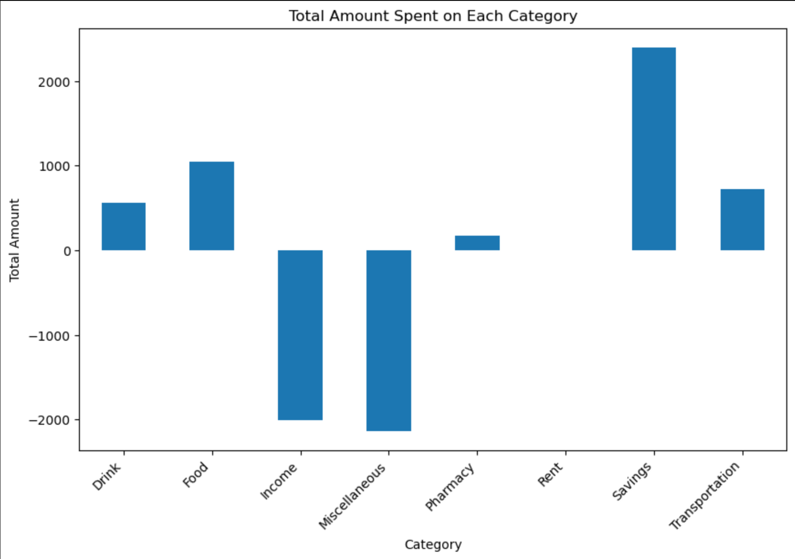

# Budget
 
## Purpose
After having a bank account for quite some time, I decided to keep better track of my spending. While many people either manually look at every charge in their card's history or don't look at all, I wanted to automatically sort my spending and sum the charges based on category. I then created this project in order to do just that. I focused mainly on finding a way to see how much money I spent on food or on transportation and also keep track of my income. I also wanted to easily visualize my spending over time. This program can do all of that.

## Instructions
First, make sure you have cloned this respository (titled Budget). Then, add a spreadsheet of your spending as an excel workbook to the 'Data' folder in this repository. The columns of the spreadsheet should be in the following order: date, status, type, check number, description, withdrawal, deposit, running balance. 

You should now be able to either run the program (titled BudgeJudy.py) in a terminal or open and run the jupyter notebook (titled BudgetRunner.ipynb) remotely on your machine. Restarting the kernel and running all of the cells in the notebook will first run the python program, and then provide some additional visualizations.

## Use
Enter the name of your excel workbook,

pick the range of dates you want to analyze and enter their day, month and year separately. 

Then, enter what you want the title of your new sheet you to be. 

The program will then update the excel workbook by making opening a new sheet and filling it with you spending per month on each category. 

The program then creates a bar plot of total spending on each category and subcategory. 

Finally, you will be asked if you want to visualize your spending over time, where the program can create a lineplot showing the progression of your spending per month on some or all of the categories of interest. 

